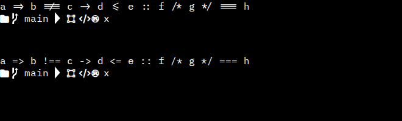

# Spike 7.11 — terminal font with ligatures and Nerd Font glyphs

Research for TODO 7.11 (2026-09-25). Nothing is committed to the app yet: no package added, no font file in the repo. The human chooses; the exact approvals needed are listed at the end.

## Recommendation

1. **Ligatures in xterm are possible without any new package.** Register a character joiner (`term.registerCharacterJoiner`, about 10 lines in `src/terminals.ts`) with the list of sequences the font has ligatures for, and set `allowProposedApi: true`. The WebGL renderer, which the app already uses, draws each joined range as one string, so the browser applies the font's `calt` ligatures. Proven in Chromium with xterm 6.0.0 + addon-webgl 0.19.0 (screenshot below). `@xterm/addon-ligatures` brings nothing more in a WebView (see §1) and is 204 KB.
2. **Font: "Hive Mono"**, IBM Plex Mono with Fira Code's ligatures copied in by Ligaturizer, renamed because "Plex" is a Reserved Font Name. 4 weights × ~62 KB woff2.
3. **Nerd glyphs as a separate fallback family**, `Symbols Nerd Font` (the Nerd Fonts "symbols only" release, 1.07 MB woff2), instead of patching every weight (4 × ~1.01 MB). `fontFamily: '"Hive Mono", "Symbols Nerd Font", monospace'`. No xterm option changes (§2).
4. Total added to the bundle: **≈ 1.3 MB** (vs ≈ 4 MB fully patched). Build: `scripts/build-terminal-font.sh` (§5).

Top terminal: joiner on (`=>` `!==` `->` `<=` `===` become ligatures). Bottom: same font, no joiner. Second row: Nerd glyphs (folder, git branch, Powerline arrow, Material Design U+F0001, code icons) served by the fallback family. Rendered by headless Chromium (SwiftShader WebGL), the engine of WebView2.

## 1. Can xterm.js draw ligatures in the WebView?

- The app uses `@xterm/xterm` 6.0.0 and `@xterm/addon-webgl` 0.19.0 (`package.json`), WebGL with a DOM fallback on context loss (`src/terminals.ts`).
- xterm draws each cell separately, so a font's ligatures never apply by themselves. The hook is `registerCharacterJoiner` (proposed API): the typings say *"character joiners are only used by the webgl renderer"*, and `addon-webgl` 0.19 calls `getJoinedCharacters`. So ligatures work only while the WebGL renderer is active; the DOM fallback shows plain text.
- **`@xterm/addon-ligatures` 0.10.0** (latest, 2025-12-22) no longer uses Node: its source has no `fs`/`require`. Its npm README is stale (still says "Node.js" and "canvas renderer"). It gets the font's ligature table via the Local Font Access API, else uses a built-in `fallbackLigatures` list. In a WebView that path never works:
  - Local Font Access only sees **installed system fonts**, never a font loaded with CSS `@font-face` — our bundled font would not be found anyway.
  - Its first branch calls `navigator.fonts.query()`, which does not exist in Chromium; `queryLocalFonts` is never reached ([xterm.js#6151](https://github.com/xtermjs/xterm.js/issues/6151), open). WKWebView has no Local Font Access at all.
  - So in WebView2 and WKWebView the addon always ends up in its fallback list, i.e. exactly the joiner recommended above, plus a bundled opentype.js that never runs. Its `package.json` also still declares the Node-only `font-finder` dependency, and 0.10.0 shipped without its CJS entry ([#5822](https://github.com/xtermjs/xterm.js/issues/5822)).
- Our own joiner fed with **the font's exact ligature list** is better than the addon's generic Iosevka list: `scripts/build-terminal-font.sh` writes `ligatures.json` (136 sequences, the ones Ligaturizer copied). A sequence not joined is drawn char by char (no ligature); a joined sequence the font has no ligature for is drawn normally.
- Known issues, none blocking with a short fixed list:
  - Very long ligatures (Fira `=====…`) could hang the atlas ([#4362](https://github.com/xtermjs/xterm.js/issues/4362), [#5246](https://github.com/xtermjs/xterm.js/issues/5246)); our list is ≤ 5 characters, so runs never grow.
  - Joined runs can be clipped by a fraction of a pixel when the cell width is fractional ([#6153](https://github.com/xtermjs/xterm.js/issues/6153), open; noticeable from ~8 chars).
  - Cursor over a ligature on WebGL was fixed ([#5205](https://github.com/xtermjs/xterm.js/issues/5205), closed 2025-12-28, before 6.0.0).
- VS Code (same xterm) offers the same mechanism as `terminal.integrated.fontLigatures.fallbackLigatures` ([docs](https://code.visualstudio.com/docs/terminal/appearance)).
- **Not verified:** WKWebView (macOS). WebKit canvas text applies `calt` by default like Chromium; the check belongs to the implementation task on a Mac / in the macOS CI.

## 2. Nerd glyphs: xterm options

- **`rescaleOverlappingGlyphs`**: leave at its default (`false`). Its docs say *"Nerd font glyphs"*, Powerline and emoji are never rescaled anyway; it exists for ambiguous-width CJK text (GB18030).
- **`customGlyphs`**: leave at its default (`true`). xterm then draws box drawing and block elements (U+2500–259F) and the Powerline separators (U+E0B0–E0B7) itself, pixel-aligned; every other Nerd icon comes from the font.
- Icons are one cell wide in the grid; the non-Mono Nerd symbols are drawn larger and may overflow into the next cell, which is what terminal prompts expect (they put a space after an icon). The "Mono" variant keeps icons inside one cell but makes them tiny.
- Fallback per glyph works in the WebGL atlas: it draws each glyph with the CSS font list, so the browser picks `Symbols Nerd Font` for code points that Hive Mono lacks (the screenshot shows it).

## 3. Licences

| Part | Licence | What it requires |
|---|---|---|
| IBM Plex Mono 2.5.0 | SIL OFL 1.1, **Reserved Font Name "Plex"** (`Copyright © 2017 IBM Corp. with Reserved Font Name "Plex"`) | A modified version (ligatures, patched glyphs) **must not use "Plex" in its name**; ship the OFL text; not sold alone. This is why Nerd Fonts calls it "Blex Mono". |
| Fira Code 3.1 (ligature glyphs) | SIL OFL 1.1, no Reserved Font Name | Keep the copyright notice (Ligaturizer appends it to the font's copyright). |
| Ligaturizer v5 | GPL-3.0 | Build tool only; not shipped. The GPL does not cover the fonts it outputs. |
| Nerd Fonts font-patcher / Symbols Nerd Font 3.5.1 | MIT for the project; each icon set keeps its own licence | Icons: Codicons and Font Awesome **CC BY 4.0** (attribution), Material Design **Apache 2.0**, Octicons/Devicons/Seti/Powerline MIT, Weather Icons and Pomicons OFL, Font Logos "unlicensed" (brand logos, trademarks of their owners). An attribution line (e.g. in an about/licences file) covers CC BY. |

The output family is **"Hive Mono"** (patched variant: "HiveMono Nerd Font"); the build refuses a `FAMILY` containing "Plex". The name table keeps IBM's copyright and the trademark notice (`IBM Plex® is a trademark of IBM Corp`), which is a notice, not a font name. `LICENSE-IBM-Plex-Mono.txt` is written next to the fonts and must ship with them.

## 4. Size

Today: `@fontsource/ibm-plex-mono` 400/500/600 imported in `src/styles.css`, bundled by Vite (no network; `tauri.conf.json` has `"csp": null`, so a local `@font-face` needs no CSP change). The Latin subsets are ~15 KB each (14 708 / 14 888 / 15 620 B), other subsets load only if used.

Measured outputs (woff2, this machine):

| File | Size |
|---|---|
| HiveMono-Regular / Medium / SemiBold / Bold | 61 732 / 62 576 / 63 088 / 62 752 B |
| SymbolsNerdFont-Regular | 1 065 800 B |
| **Recommended total (4 weights + symbols)** | **≈ 1.3 MB** |
| HiveMonoNerdFont-<weight> (fully patched, `NERD_PATCH=1`) | ≈ 1 010 000 B each, ≈ 4 MB for 4 weights |
| For reference: Blex Mono Nerd Font Regular (no ligatures), Mono variant | 992 944 B / 1 029 068 B |

Hive Mono is the full Plex glyph set (1 548 glyphs, every spacing glyph 600 units wide), not a Latin subset; subsetting (e.g. `pyftsubset`) could cut it to ~20 KB per weight but needs another tool: not worth it for ~250 KB.

Weights: xterm uses `fontWeight` normal (400) and `fontWeightBold` `"bold"` (700); today 700 is not bundled, so the browser falls back to 600. Regular + Bold are enough for the terminal; Medium/SemiBold only matter if the editor uses them.

## 5. Build script

`scripts/build-terminal-font.sh [OUT_DIR]` (default `/var/tmp/hive-terminal-font.XXXXXX`; refuses a directory inside the repo):

- Downloads pinned inputs and checks each sha256: IBM Plex Mono 2.5.0 (release zip), Ligaturizer v5 (`c406518`), Fira Code 3.1 OTFs (the commit Ligaturizer pins), Nerd Fonts 3.5.1 `NerdFontsSymbolsOnly.tar.xz` (and `FontPatcher.zip` with `NERD_PATCH=1`), FontForge 20251009.
- **FontForge**: uses `$FONTFORGE` if set (`sudo apt install fontforge python3-fontforge`, `brew install fontforge`); otherwise, on Linux x86_64, downloads the official AppImage and runs it extracted in the work dir. Nothing is installed on the system. Docker was not needed (and is not available in this WSL).
- Writes `HiveMono-<Weight>.woff2`, `SymbolsNerdFont-Regular.woff2`, `ligatures.json`, `LICENSE-IBM-Plex-Mono.txt`; with `NERD_PATCH=1` also `HiveMonoNerdFont-<Weight>.woff2` (Nerd Fonts `font-patcher --complete`, ~1 min per weight). Env: `WEIGHTS`, `FAMILY`.
- Ran here: default build in 9 s (inputs cached), patched build ≈ 3.5 min for 4 weights. Checked with FontForge: 136 `calt` ligature lookups in the output, every spacing glyph 600 units wide, Nerd code points (U+E0A0, U+F07B, U+F0001) present in the patched fonts.
- Finding: Fira Code **6.2** cannot be used — it ships only TTFs, and FontForge (2023 and 2025 builds) segfaults on save after Ligaturizer pastes its ligatures. The OTFs of Fira Code 3.1 work; Ligaturizer's ligature list targets that version anyway.

## 6. Alternatives

| Option | Ligatures | Nerd glyphs | Added size | Notes |
|---|---|---|---|---|
| **A. Hive Mono + Symbols Nerd Font fallback + own joiner (recommended)** | terminal (WebGL) + editor | yes | ≈ 1.3 MB | No package; build script needed |
| B. Hive Mono Nerd Font (fully patched) + own joiner | same | yes | ≈ 4 MB | One family, 3× bigger |
| C. Blex Mono Nerd Font (official download) | none | yes | ≈ 1 MB per weight | No build at all; same Plex look |
| D. Blex Mono Nerd Font in the terminal, Hive Mono (ligatures) only in CodeMirror | editor only | terminal | ≈ 2.2 MB | CodeMirror is DOM text: ligatures work by CSS alone |
| E. `@xterm/addon-ligatures` instead of own joiner | same as A | – | +204 KB JS | Ends in the same fallback list in a WebView (§1) |

## What the human must approve

1. **No new package** (option A/B/C/D). Only E would add `@xterm/addon-ligatures` (`bun add @xterm/addon-ligatures`) — not recommended.
2. **Font files to commit** (option A), e.g. under `src/assets/fonts/`: `HiveMono-Regular.woff2`, `HiveMono-Bold.woff2` (and `-Medium`/`-SemiBold` if the editor needs them), `SymbolsNerdFont-Regular.woff2`, `LICENSE-IBM-Plex-Mono.txt`, plus the generated `ligatures.json` list (or the list inlined in `src/terminals.ts`), and an attribution line for the CC BY icon sets.
3. **The family name** "Hive Mono" (any name without "Plex" works) and whether `www` (a Fira ligature in the list) stays.
4. **Defaults** in `hive-protocol` (`font_family` default, `docs/architecture.md`, `docs/ui-reference.md`) and `docs/hive.md` (the human's). Existing `settings.json` files that already store `"IBM Plex Mono", monospace` keep it unless the human wants a migration. The editor needs its own CSS variable: `--font-mono` is also used by the UI, which keeps IBM Plex Mono.
